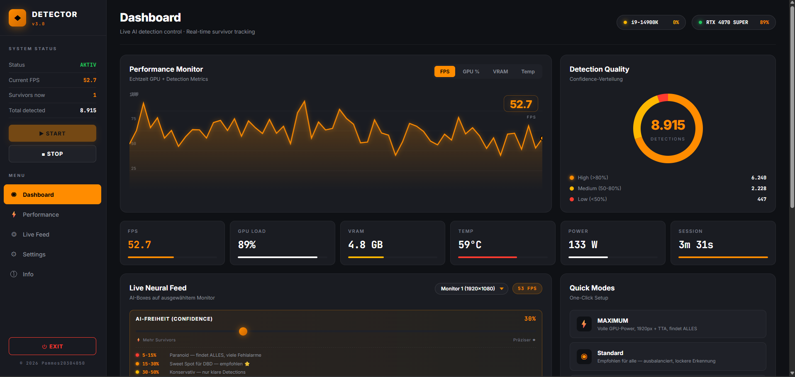
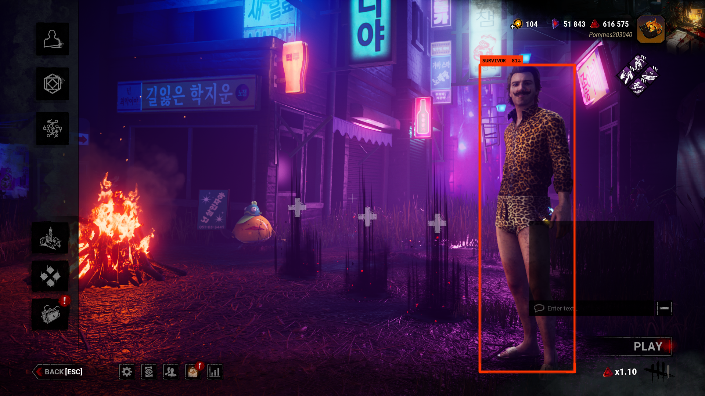
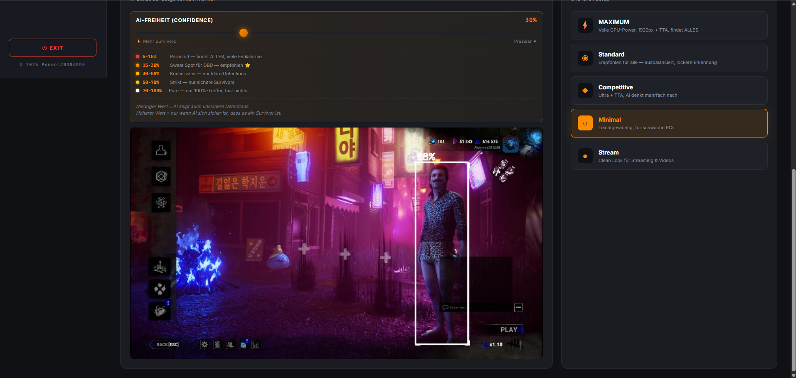

# DBD Survivor Detector

Real-time YOLOv8-basiertes Erkennungssystem für Survivor-Charaktere in Dead by Daylight.
Transparentes Overlay + Echtzeit-Dashboard mit GPU/CPU-Monitoring, TensorRT-Beschleunigung und Live-Konfiguration.



## Features

- **YOLOv8-Large Fine-tuned Modell** — 96.8% mAP@50 auf eigener Trainingsdaten (2210 Bilder)
- **TensorRT FP16 Engine** — 2-3x schneller als PyTorch (84 FPS @ 1280px)
- **Transparentes Overlay** auf DBD mit Click-Through
- **Live Dashboard** mit Sidebar-Navigation, FPS/GPU/VRAM/Temp-Chart
- **5 Quick Modes** (Maximum / Standard / Competitive / Minimal / Stream)
- **6 Performance Profile** von 1920px+TTA bis 480px Extreme
- **HUD-Filter** ignoriert Killer-Hand, Survivor-Portraits, Perks
- **Aura-Filter** unterscheidet rote Killer-Aura von Survivors in roter Kleidung
- **Monitor-Auswahl** via Dropdown (dxcam + mss Fallback)
- **Global F-Hotkey** für Force-Capture während des Spiels
- **Self-Training Loop** mit Auto-Labeling + Boost-Mechanismus

### Preview




## Performance (RTX 4070 Super)

| Config             | FPS  | VRAM  |
|--------------------|------|-------|
| Ultra (TRT+TTA)    | 60   | 1.5GB |
| High (960px+TTA)   | 130  | 1GB   |
| Balanced (768px)   | 180  | 700MB |
| Fast (640px)       | 250  | 500MB |
| MAX GPU (1920+TTA) | 12   | 4GB   |

## Requirements

### Hardware
- **GPU:** NVIDIA mit CUDA 12.x, min. 6GB VRAM (empfohlen 12GB+)
- **RAM:** 16GB+
- **CPU:** Moderner x64 Prozessor (i5/Ryzen 5 8. Gen+)
- **OS:** Windows 10/11 (Linux funktioniert, Overlay nur Windows)

### Python
- Python 3.10, 3.11 oder 3.12
- NVIDIA Treiber 535+ mit CUDA Toolkit 12.x

### Python-Pakete

Siehe `requirements.txt`:

```
torch>=2.0.0              # PyTorch mit CUDA-Support
torchvision>=0.15.0
ultralytics>=8.0.0        # YOLOv8
opencv-python>=4.8.0
mss>=9.0.0                # Screen Capture (Fallback)
dxcam>=0.3.0              # DirectX Screen Capture (schneller)
numpy>=1.24.0
pandas>=2.0.0
pynput>=1.7.6             # Global Hotkeys
PyQt5>=5.15.0             # Transparent Overlay
flask>=2.0.0              # Web Dashboard Server
flask-cors>=6.0.0
tqdm>=4.60.0
pynvml>=13.0.0            # NVIDIA GPU Monitoring
psutil>=5.9.0             # CPU Monitoring
```

### Optional (für maximale Performance)

```
tensorrt-cu12             # 2-3x schnellere Inferenz
onnx>=1.21.0
onnxslim
onnxruntime-gpu           # Alternative zu TensorRT
customtkinter>=5.2.0      # Für ui.py (Training-GUI)
```

### Installation

```bash
# PyTorch mit CUDA 12.4
pip install torch torchvision --index-url https://download.pytorch.org/whl/cu124

# Alle anderen Abhängigkeiten
pip install -r requirements.txt

# Optional: TensorRT
pip install --extra-index-url https://pypi.nvidia.com tensorrt-cu12 onnx onnxslim
```

## Quick Start

```bash
# Starten
start_v3.bat          # oder: python overlay/overlay_server.py

# Beenden (alles)
stop.bat
```

Browser öffnet automatisch `http://localhost:8765` mit dem Dashboard.

## Projektstruktur

```
dbd-survivor-detector/
├── overlay/
│   ├── overlay_server.py     # Hauptsystem (Qt Overlay + Flask + YOLO)
│   ├── templates/index.html  # Dashboard HTML
│   └── static/
│       ├── style.css         # Cyberpunk Orange/Black Design
│       └── app.js            # Live-Updates, Chart, API
├── src/
│   ├── live_auto_label.py    # Live Screenshot + Auto-Label (F-Hotkey)
│   ├── label_tool.py         # OpenCV Manual Labeling
│   ├── gallery.py            # Bild-Browser mit Lösch-Funktion
│   ├── capture.py            # Screenshots aus Video/Screen
│   ├── auto_label.py         # Batch-Video-Labeling
│   ├── train.py              # YOLOv8 Training
│   ├── boost.py              # Oversampling seltener Samples
│   ├── monitor.py            # Einfacher Live-Monitor
│   ├── detector.py           # Standalone Detector
│   ├── test_models.py        # Side-by-Side Modellvergleich
│   ├── relabel.py            # Labels mit Modell neu erstellen
│   └── backup.py             # Versionierung
├── models/                   # Trainierte Modelle (gitignored)
├── data/                     # Training-Daten (gitignored)
├── start_v3.bat              # Launcher
├── stop.bat                  # Shutdown-Script
└── DESIGN_PROMPT.md          # Prompt für AI-Design-Tools
```

## Training Workflow

1. **Screenshots sammeln** via `live_auto_label.py` (F-Hotkey während Spiel)
2. **Labeln** mit `label_tool.py`
3. **Oversample harte Fälle** mit `boost.py`
4. **Trainieren** mit `train.py`
5. **Testen** mit `test_models.py`

## Modelle

| Version | Bilder | mAP@50 | Recall | Precision | mAP@50-95 |
|---------|--------|--------|--------|-----------|-----------|
| v1      | 241    | 97.0%  | 86.6%  | 95.7%     | 68.7%     |
| v2      | 1011   | 97.9%  | 96.3%  | 94.1%     | 72.0%     |
| **v3**  | **2210** | **96.8%** | **95.7%** | **95.8%** | **81.4%** |

v3 ist das finale Produktions-Modell — signifikant bessere Box-Präzision (mAP@50-95).

## Dashboard-Features

- **Performance Monitor** — Switchable Chart (FPS / GPU / VRAM / Temp)
- **Detection Quality Donut** — Confidence-Verteilung
- **6 Mini-Stats** — FPS, GPU-Load, VRAM, Temp, Power, Session
- **Live Neural Feed** — MJPEG Stream mit AI-Boxes
- **Monitor-Dropdown** — Wechsel zwischen angeschlossenen Displays
- **AI-Freiheit Slider** — Live Confidence-Anpassung (5-100%)
- **Quick Modes** — Ein-Klick Setup
- **Advanced Settings** — Box-Dicke, Farbe, Glow, Filter

## License

**All Rights Reserved** — Copyright © 2026 Pommes20304050

Proprietary and confidential. See [LICENSE](LICENSE) for details.
No copying, distribution, or modification permitted.
